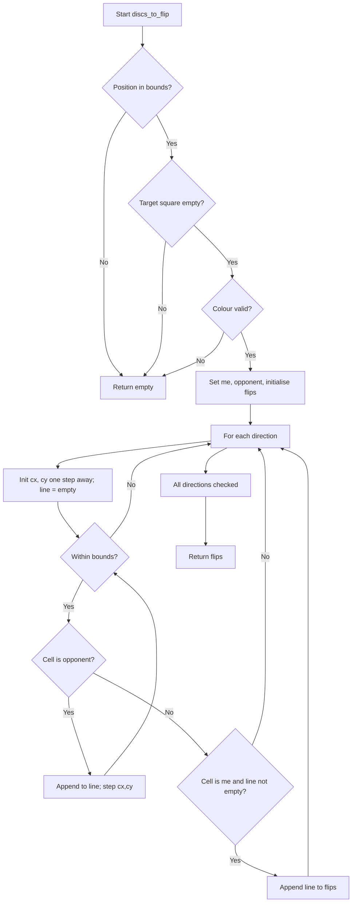
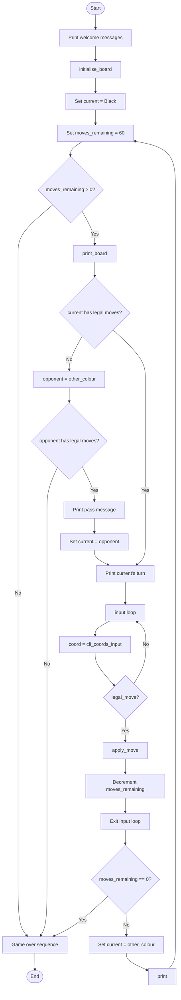
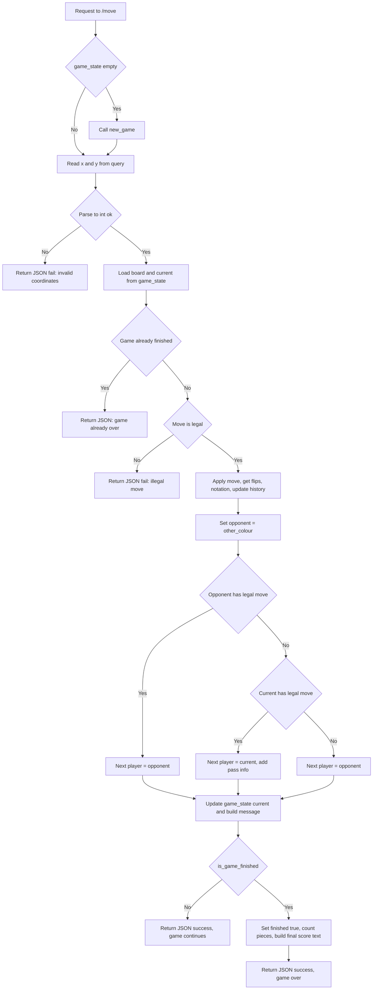
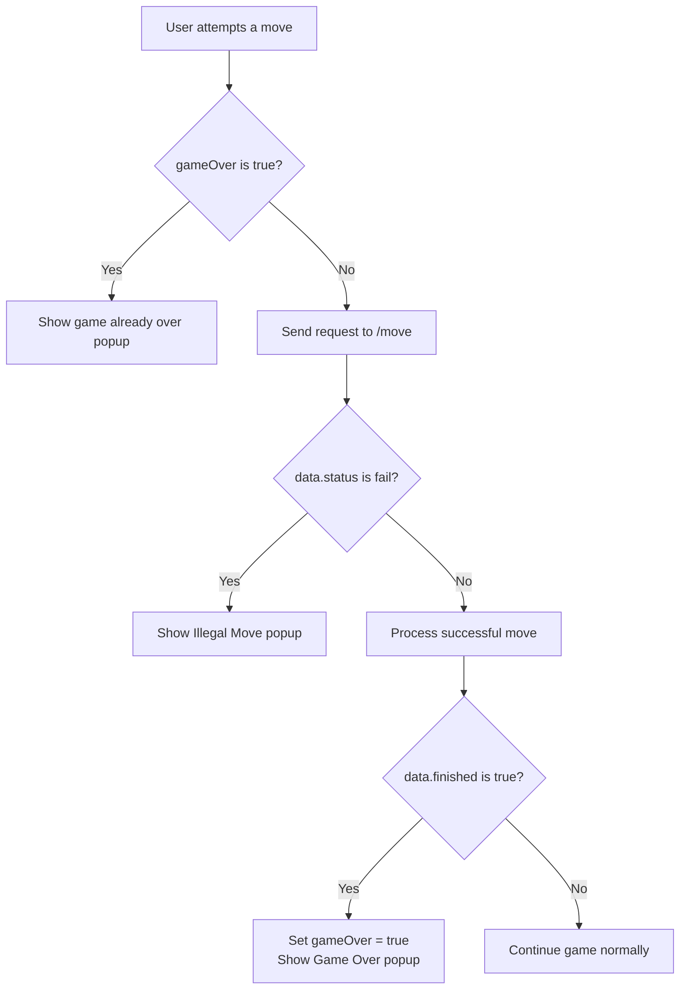
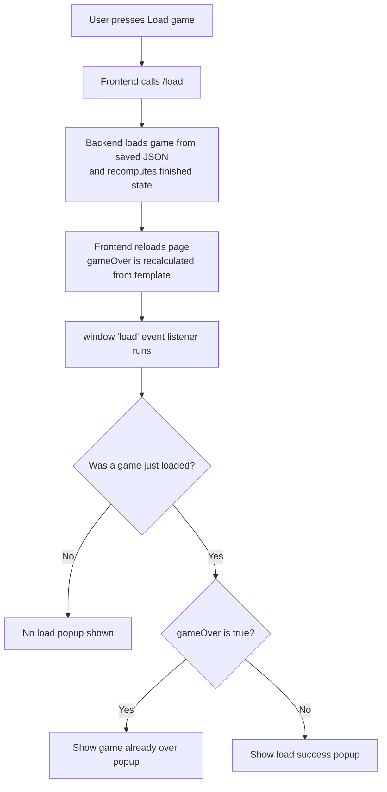
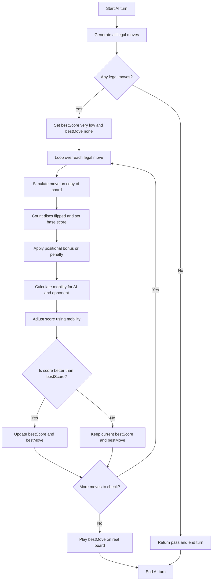

# Othello – Flask Web Application

This project implements the complete rules of the Othello board game using a Python Flask backend, along with a Windows XP-style frontend. The goal was to keep the logic clean while making the interface a bit more fun than a typical HTML project.

---

## How to Run
1. Install dependencies `pip install -r requirements.txt`
2. To play the CLI version run `game_engine.py`, and for the web version `flask_engine.py`.

See full setup and running instructions inside `manual.doc`.

---

## Table of Contents

- [Othello – Flask Web Application](#othello--flask-web-application)

- [1. Technical Breakdown](#1-technical-breakdown)
  - [1.1 components.py - Core Game Logic](#11-componentspy---core-game-logic)
  - [1.2 game_engine.py - Command-Line Game Engine](#12-game_enginepy---command-line-game-engine)
  - [1.3 flask_engine.py - Flask Web Backend](#13-flask_enginepy---flask-web-backend)
  - [1.4 Othello Board.html - Flask Web Frontend](#14-othello-boardhtml---flask-web-frontend)

- [2 AI Opponent](#2-ai-opponent)

- [3 Testing](#3-testing)

---

# 1. Technical Breakdown

Below are the three main Python modules, each split into:
1. **Overview** – what the module does  
2. **Flowchart** – space for diagrams of the main algorithms  
3. **Design Rationale** – why the module is structured the way it is  

Additionally, a section on the html and how it ties in with the backend is included.

---

# 1.1 `components.py` - Core Game Logic

### **Overview**
`components.py` contains all the logic required to implement Othello’s rules.  
Key responsibilities include:
- creating the board (`initialise_board`)
- printing the board (`print_board`)
- determining discs to flip (`_discs_to_flip`)
- checking move legality (`legal_move`)
- applying a move (`apply_move`)
- counting pieces (`count_pieces`)
- storing board constants and scanning directions

Each function operates only on the board state and does not depend on user input or Flask, making it the foundation that both the CLI and web versions use.

### **Flowchart Section**
Below is the flow chart for `_discs_to_flip`

This helper function identifies which opponent discs would be captured if a player
placed a piece at a given coordinate. First it checks
that the target square is inside the board, unoccupied, and that the provided
colour is either `"Black"` or `"White"`. After establishing the current player and
opponent, it looks in all eight directions in `DIRECTIONS`.

For each direction, the function "walks" step by step across the board, collecting
consecutive opponent discs. If it eventually reaches one of the player’s own discs
without encountering an empty square first, those collected positions form a valid
line of discs to flip. These lines are aggregated into the `flips` list, which the
function returns. If no direction forms a complete bracket, the result is simply an
empty list.

### **Design Rationale**
- All game rules are in one module so the CLI and Flask engines never differ in core gameplay behaviour.  
- A 2D list is used because it is easy to index and makes sense for an 8×8 Othello board.  
- The disc-flipping algorithm is implemented once and reused for both legality checking and move application, preventing logic duplication.  
- Constants and direction vectors are defined centrally to avoid duplication, and make potential changes easier.  

---

# 1.2 `game_engine.py` - Command-Line Game Engine

### **Overview**
This module implements a fully playable console version of Othello, which can be used for testing the game functionality. 
It handles:
- parsing user input of coordinates (`parse_letter_number_input`)
- asking repeatedly until input is valid (`cli_coords_input`)
- checking for legal moves (`has_any_legal_moves`)
- switching turns, aided by `other_colour`
- running the full game loop (`simple_game_loop`)
- determining the winner using `count_pieces`

### **Flowchart Section**
The core of the CLI version of the game is `simple_game_loop`.
Below is the flowchart that illustrates the basic design of the algorithm.

This function is the core of the CLI Othello game. It starts by setting up the board with `initialise_board()`, assigning first player, sets `move_count` to 60, and then enters a loop that alternates between Black and White.  
Every turn, the current board is displayed with `print_board()` and checks whether the current player has any legal moves using `has_any_legal_moves()`.

If at least one legal move exists, then the player is asked for their move by `cli_coords_input()`, which loops until an input of the valid form (e.g 'A4', 'b 3') is submitted.  
And then the move is validated with `legal_move()`. A successful action is applied using `apply_move()`, which also returns the number of discs flipped.  
If the current player has no legal move, the move is simply passed.

The `move_count` ticks down each time a move is performed, acting as a hard limit on how many turns the entire match can have. Even if players still have legal moves remaining, once this counter reaches zero the loop stops immediately and the game is forced to end.
Although, this rule does seem obselete. The algorithm must check that at least one of the two players can move, but in a situation where `move_count = 60`, that is, the board is full of discs (since you start with 4), there will be no legal moves anyways, so standard legal move detection encapsulates this.

After each turn or pass, the loop checks whether both players have run out of legal moves or not again using `has_any_legal_moves()`. As per the standard Othello rules, if both players have ran out of moves then the game is over, and the winner is the player with more discs remaining on the board, which is computed using `count_pieces()`.  
If either player still has a legal move, the game continues. The loop keeps running until the game reaches the end and displays a message.

### **Design Rationale**
- `cli_coords_input()` accepts various forms of input (e.g 'A4', 'b 3') and also allows the user to quit.
- Input handling and rule logic are separated cleanly: the CLI only asks the player for coordinates, and `components.py` determines if the move attempted is legal or not. This keeps the rules consistent and avoids duplicate logic. 
- Keeping turn switching inside `other_colour` improves readability and reduces repeated string logic.  
- An explicit infinite loop with a single termination branch is used so control flow is easy to trace.

---

# 1.3 `flask_engine.py` - Flask Web Backend

### **Overview**
This module powers the browser based version of the game.  

Main responsibilities:
- creating and resetting games (`new_game`, `restart`)
- validating and applying moves (`/move`)
- reporting board updates and status messages
- saving and loading game state (`save`, `load`)
- determining when the game ends (`is_game_finished`)
- converting coordinates to notation (`coord_to_notation`)
- serving the main board page (`index`)

### **Flowchart Section**
The `/move` route is the core route of the Flask game, which is called whenever the user clicks on a square of the Othello board.
Below is the flowchart that illustrates the basic structure of the algorithm.

### **Design Rationale**
- In this version, the `move_counter` variable is removed as it's obsolete for `move_counter>=60` and for `move_counter<60` it's not standard in the real version of the game.
- A single `game_state` dictionary centralises all mutable runtime data.
- The `game_finished` variable allows routes to reject further moves immediately, ensures consistent behaviour when loading a saved game, and prevents repeated endgame evaluations.  
- A move attempt on a finished game returns a `"success"` response to clearly separate it from an illegal move, this was a bug before that affected UX.
- This Flask engine is intentionally minimal. It just updates the game state and leaves all actual game logic to the helper functions.
---

# 1.4 `Othello Board.html` - Flask Web Frontend

### Overview
This html has been heavily modified from the original template.
UI changes include new Windows XP-style design, including fake icons, taskbar,and windows.
UX changes include adding load/save/restart functionality, informational popups and draggable windows.

### Technical Breakdown
A core feature of Othello is the game actually ending and for proper UX, this must be handled by always showing the appropriate popup message:

- Since `gameOver` is injected by Jinja into the template, it is recalculated each time the browser performs a full page reload (i.e. a new request to the / route).
This is extremely important for handling cases where we load a finished game, the backend computes whether the game has finished or not and a `window.load` event listener is used to check if a game has been loaded.
If a game has been loaded and `gameOver` is truthy, then a **"Game has already ended"** popup is displayed.
- At each move attempt, `gameOver` is checked to determine if the game has already ended. 
  - If it has, then a **"Game has already ended"** popup is displayed. 
  - If the hasn't, a JS request will be sent for the backend to process.
  In the JSON response, if `data.finished` is truthy, then the game is marked as over and the **"Final result popup"** is displayed.

### Flowchart Section
A high level flowchart of the logic behind game over handling design is below.
Starting with the user making a move:

And for loading potentially finished games:

Making a move and loading a game perfectly contain all scenarios where a change to the game is made,
and therefore contain all scenarios where we may need to consider the game's finish status.

# 2 AI Opponent
The goal of this algorithm is to design an AI with a strategy that is less superficial than a greedy algorithm of just selecting the first legal move that it finds, and therefore should perform a bit better

1. On its turn as White, the AI starts by generating all its legal moves.
   - If the AI has no legal moves available, it simply passes and ends its turn.

2. Each legal move is then scored with the following system:
   - The AI simulates the move on a copy of the board.
   - It counts how many discs would be flipped by that move.
     - The initial score is set as:  
       `score = flips`

   - Bonuses or penalties based on position are then applied:
     - Corner squares: add a large bonus because corner positions are extremely strong and cannot be flipped.
     - Safe edge squares: add a small bonus as stable edge positions are usually helpful.
     - Danger squares (adjacent to an unclaimed corner): subtract a penalty because moves here often give the opponent a chance to take a corner on the next turn.
     - Other squares do not affect `score`.

   - The AI also considers mobility after the simulated move:
     - It works out how many legal moves it would have on the next turn (`my_moves_after`).
     - It then checks how many moves the opponent would have (`opp_moves_after`).
     - A mobility term is added to the score:  
       `score += weight(my_moves_after - opp_moves_after)`, for some `weight`.
       This rewards moves that give the AI more freedom while limiting the opponent.

3. After all moves have been scored:
   - The AI selects the move with the highest total score.
   - It plays that move on the actual game board.
   - This move is returned as the AI's decision for the turn.

The flowchart for this algorithm is below:

Because this algorithm only sees one move ahead and the bonuses are fixed, it may be susceptible to traps and strategies that take a couple of moves.
Therefore, it is still somewhat superficial. 

In future, it may also be useful to create a framework for creating and benchmarking different AI strategies to optimise weightings, determine which model is better, etc.

# 3 Testing
All tests are written using pytest and inside the `tests` directory.
Each test is designed to mirror a part of the application and uses pytest fixtures and monkeypatching to isolate behaviour without touching real files.
Additionally, it is important to note that trivial functions are not tested.

To run the full test suite: `pytest`.

